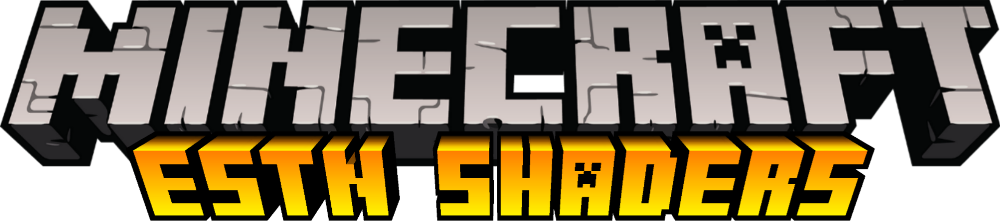

# Description
   **ESTN Shaders** (short ver. of Eldeston) is a shader pack made to change your gameplay’s looks through shaders, like the water noise, plant waves, shader based sun and moon, monochromatic weather, and much more! Presented to you by FlameRender Studios.

# Table of contents
* [Disclaimer](#disclaimer)
* [From the creator](#from-the-creator)
* [Special thanks](#special-thanks)
* [Official McpeDL upload](#official-mcpedl-upload)
* [Bugs and errors](#bugs-and-errors)
* [Configuration](#configuration)
* [License](#license)
* [About creator](#about-creator)

# Disclaimer
   This shader is **only for mobile and Win10 editions** of Minecraft. There will be **no Console version** of this shader as it has the Render Dragon Engine which can’t run any shader packs from the previous engine. For more info, continue reading the description.

   This shader also works on **Minecraft Education Edition** in certain versions. However, the results may be different compared to other platforms. **This shader supports Minecraft Bedrock v1.16.0+**. Minecraft versions with the **new engine** will not be able to apply shaders like this into the game as the new engine doesn’t support shaders from the old engine, *please check the changelog of the version of Minecraft you’re playing if it has been updated to Render Dragon.*

# From the creator
   I have mentioned that 1.6.0 will be the last update for ESTN Shaders, due to a lot of unfixable bugs and performance issues, but today, I will give one more last update for Win10 users who would love to experience ESTN Shaders on their PCs. So yeah, it’s the last update for real, but I’m developing other stuff too. I’m planning on creating another shader to become a successor of ESTN once Render Dragon is out on all platforms. So please keep an eye on my next projects!

# Special thanks
   Huuuuge thank you to **Xanion** for creating a port for **ESTN on Win10**! I didn’t have a laptop so he helped port ESTN to the Win10 edition of Minecraft. Check out his content here on [McpeDL](https://mcpedl.com/user/xanion/)!

# Official McpeDL upload
   ESTN just happen to be on McpeDL too! Check it out [here](https://mcpedl.com/estn-shaders/?cookie_check=1) and show your support by clicking on one of the download links there!

# Bugs and errors
   Most of the bugs known in ESTN Shaders at the moment are precision related, and some for some reason, not solvable. Most of these issues came from iOS devices and some from ancient android devices. However these bugs are hard for me to fix, so it might be better to use this shader on mid to high end phones or use a preset that minifies those bugs. For Win10, there is a bug when you mess with the AA (anti-aliasing) toggle it makes everything black, it seems to only happen if the AA is off.

# Customization/Configuration
   Information about the configuration and customization of this shader is found in this repository's wiki page [here](https://github.com/Eldeston/ESTN-Shaders/wiki). Will be planning to upload preset files on the wiki made by the server-community. A video tutorial will be planned later as well.

# License
   This shader has been completely overhauled which means I can give it a new license, so this pack now uses the GNU GPL License. This means you can share/repost this pack anywhere except McpeDL as long as there is a copyright notice. I recommend that you should inform me before you go repost this shader. Info about this license will be found at [choosealicense.com](https://choosealicense.com/licenses/gpl-3.0/) or in `LICENSE.txt`.

# About creator
   Check out my latest project **Super Duper Vanilla**, a shader pack for **Minecraft Java Optifine**!
   
   
   Come join my Discord server to talk about other developments made by our studio-community!
   * [Flamerender Studios Discord](https://discord.gg/4XNhkcd)
   
   Or follow me on Twitter or subscribe to my Youtube channel to get updated with my recent developments and contents!
   * [@Eldeston's Twitter](https://twitter.com/eldeston)
   * [@Eldeston's Channel](https://www.youtube.com/channel/UCQCkkFh25ydxZwCqpBhJJlg?view_as=subscriber)

   You can become a supporter by doing any of the above, or donate through paypal!
   * [@Paypal donation](https://www.paypal.com/donate?hosted_button_id=4XLQ4WE296JKW)

# Downloads
   Extract the pack to your resource pack folder after dowloading the pack. Make sure the shader is prioritized above all the other packs. These links use no ad shorteners in case you can't download it through one of the download links in McpeDL. If possible, **please** use at least one of the download links in McpeDL for support.
   * [ESTN Github Edition 1.6.3 (latest)](https://github.com/Eldeston/ESTN-Shaders/archive/master.zip)
   * [ESTN Official 1.6.2](https://drive.google.com/file/d/1E44ah7tZrr2WXHXdumUlM0Fxt2U1_cvv/view)
